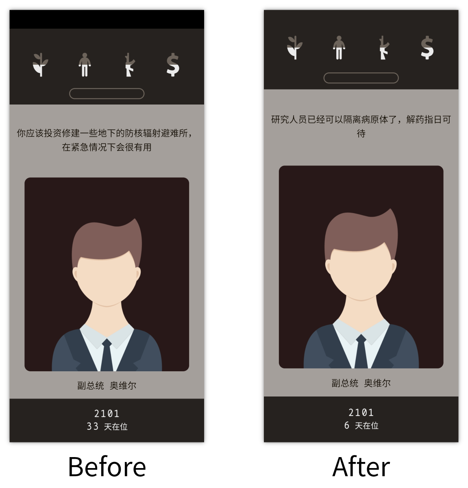

# NoDisplayCutout

强制应用在刘海/挖孔区域中呈现.
主要用于小米Mix4这种挖了孔但又没挖孔的屏下摄像头手机.

## 使用方法

1. 在Xposed ([LSPosed](https://github.com/LSPosed/LSPosed)...) Manager启用本模块.
1. 选择需要修改的应用.

对于没有root或xposed的手机可以试试WindySha的[Xpatch](https://github.com/WindySha/Xpatch).

## 致谢

* [Magisk-Modules-Repo/noneDisplayCutout](https://github.com/Magisk-Modules-Repo/noneDisplayCutout)
* [小米MIX4全屏显示模块](https://www.coolapk.com/feed/29531787)
